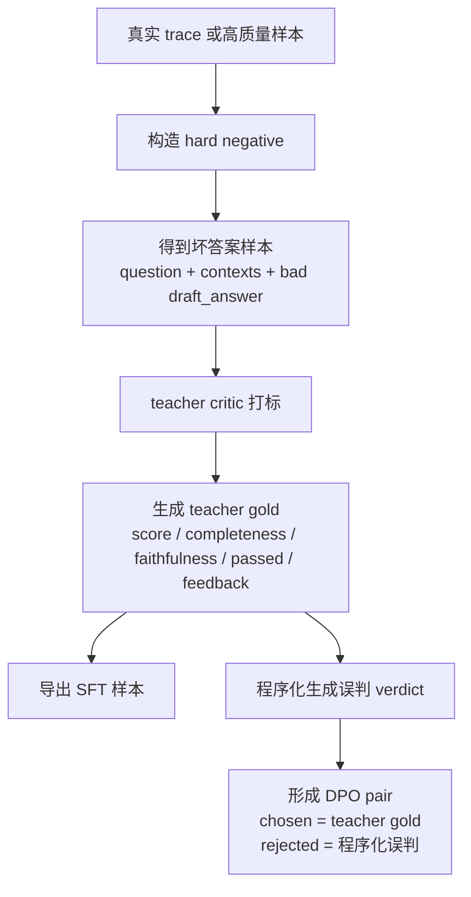

# Critic Teacher-Labeled SFT + DPO 训练方案

本文档给出一套面向 `Paper Pilot` 的 Critic 训练方案，目标是在保留“单个 Critic 模型 + Teacher-Labeled SFT + DPO 两阶段训练”设计的前提下，尽量接近真实企业项目的可落地做法。

这是一份方案文档，不代表当前仓库已经完整实现。

## 1. 目标与约束

### 1.1 目标

训练一个单独的 Critic 模型，输入：

- `question`
- `retrieved_contexts`
- `draft_answer`
- `strategy`

输出固定 JSON：

```json
{
  "score": 6.5,
  "completeness": 0.75,
  "faithfulness": 0.50,
  "passed": false,
  "feedback": "补充 QLoRA 与全量微调的显存差异，并删除未被上下文支持的结论。"
}
```

### 1.2 业务目标

该 Critic 的核心目标不是“生成好看的评语”，而是：

- 稳定输出可解析 JSON
- 更准确地区分 `pass / fail`
- 尤其降低 `false pass`
- 尤其降低“有 faithfulness 问题但被放行”的情况
- 为 retry/refine 节点提供可执行反馈

### 1.3 设计约束

- 保留单模型设计，不拆成 verifier / scorer / aggregator 多模型系统
- 保留两阶段训练：`Teacher-Labeled SFT -> DPO`
- 尽量兼容现有 `training/sft_critic.py` 与 `training/dpo_critic.py` 的整体形态
- 本地推理仍然采用“读取 prompt，生成 JSON”的方式

## 2. 训练总览

完整链路如下：

1. 采集原始样本池
2. 构建标准化 teacher gold label
3. 产出 SFT 数据集
4. 从同一批原始样本派生 DPO pair
5. 基于基座模型训练 `critic-sft`
6. 基于 `critic-sft` 继续训练 `critic-dpo`
7. 做离线验证
8. 接回 agent 主链路做端到端验证

推荐基座模型：

- `Qwen/Qwen2.5-7B-Instruct`

## 3. 数据来源设计

### 3.1 数据来源占比

建议使用混合数据集：

- `50%` 真实 agent trace
- `30%` hard negative
- `20%` LLM 合成补长尾

### 3.2 真实 trace

真实 trace 是主数据源，优先级最高。

每次 agent 运行应尽量保留以下字段：

- `question`
- `strategy`
- `retrieved_contexts`
- `draft_answer`
- `final_answer`
- `retry_count`
- `critic_feedback`
- `trace_id`
- `topic`

真实 trace 的作用：

- 贴近真实错误分布
- 提供真实上下文长度和答案风格
- 为后续 hard negative 提供“好答案母本”

### 3.3 Hard negative

Hard negative 从真实较好答案自动构造，优先做以下几类：

- 删除关键结论
- 插入未被 context 支持的句子
- comparative 问题只回答一边
- 去掉适用条件，造成过度泛化
- 错置来源结论
- 用空泛描述替代证据化陈述

这些负样本通常比纯 LLM 乱造更接近线上真实错误。

### 3.4 LLM 合成补长尾

LLM 合成样本只用于补充长尾 topic、长尾 strategy 和稀缺失败模式，不应成为主监督来源。

适合补充的场景：

- 稀有研究主题
- 极长上下文
- 少见 multi-hop 问题
- 特定策略下难以自然采集的失败样本

## 4. 原始样本池 Schema

训练前先存一层原始样本，不直接只存 `instruction/input/output`。

推荐 schema：

```json
{
  "sample_id": "trace_001284",
  "source": "trace",
  "question": "Compare LoRA and QLoRA in memory usage and quality trade-offs.",
  "strategy": "comparative",
  "retrieved_contexts": [
    {
      "doc_id": "lora_paper",
      "text": "LoRA reduces trainable parameters via low-rank updates."
    },
    {
      "doc_id": "qlora_paper",
      "text": "QLoRA combines 4-bit quantization with LoRA adapters."
    }
  ],
  "draft_answer": "LoRA and QLoRA are both parameter-efficient fine-tuning methods...",
  "gold_label": {
    "score_level": 5,
    "completeness_level": 3,
    "faithfulness_level": 3,
    "score": 7.5,
    "completeness": 0.75,
    "faithfulness": 0.75,
    "passed": true,
    "feedback": "可以再补一句 QLoRA 的量化代价。"
  },
  "meta": {
    "topic": "efficient_finetuning",
    "difficulty": "medium",
    "retry_round": 0
  }
}
```

### 4.1 标注原则

teacher gold label 建议来源：

- 小规模人工精标
- 大规模 teacher LLM 预标
- 对边界样本做人审或抽检

重点精标以下两类：

- `score` 在 `6.0-8.0` 附近的边界样本
- `faithfulness` 风险高的样本

### 4.2 标签离散化原则

不建议让 teacher 直接自由输出任意连续值，例如：

- `completeness = 0.73`
- `faithfulness = 0.79`
- `score = 6.4`

这类连续分数对 student 来说通常噪声较大，且 teacher 本身未必稳定。

本方案建议：

- teacher 先做离散等级判断
- 再映射成固定数值
- student 学固定映射后的输出

推荐映射如下。

`completeness` 和 `faithfulness` 使用 5 档：

- level `0` -> `0.10`
- level `1` -> `0.30`
- level `2` -> `0.50`
- level `3` -> `0.75`
- level `4` -> `0.95`

`score` 使用固定锚点：

- `1.0`
- `2.5`
- `4.0`
- `5.5`
- `6.5`
- `7.5`
- `8.5`
- `9.5`

其中：

- `passed = true` when `score >= 7.0`
- `passed = false` when `score < 7.0`

因此在实际输出中，`passed=true` 通常对应：

- `7.5`
- `8.5`
- `9.5`

这种设计的优点是：

- teacher 标签更稳定
- student 更容易学到边界
- DPO pair 更容易构造
- 线上判定更一致

## 5. 数据量规划

## 5.1 V1 推荐规模

建议先做一个足够有效、又不过度膨胀的版本：

- 原始样本池：`30,000`
- 训练集：`24,000`
- 验证集：`3,000`
- 测试集：`3,000`

从原始样本池派生：

- `SFT` 样本：`18,000`
- `DPO` pair：`12,000`

### 5.2 分布约束

建议控制数据分布：

- `passed=false` 占比约 `55%`
- `score 6.0-8.0` 边界样本占比约 `35%`
- comparative + multi-hop 样本占比至少 `40%`
- 明显 faithfulness 问题样本占比至少 `30%`
- `retrieved_contexts` 为空的样本不超过 `5%`

## 6. Teacher-Labeled SFT 数据集设计

### 6.1 目标

Teacher-Labeled SFT 负责教会模型：

- 严格输出 JSON
- 正确输出字段
- 粗略学会评分与 `pass/fail`
- 生成简洁、可执行的 feedback

这里的 SFT 不是纯人工标注 SFT，也不是传统 logits-level knowledge distillation。
它本质上是：

- 用真实 trace 作为输入分布来源
- 用更强的 teacher critic 生成结构化标签
- 让本地 student 模型拟合 teacher 的 JSON verdict

因此这一阶段更准确的叫法是：

- `Teacher-Labeled SFT`
- 或 `sequence-level distillation`

### 6.2 SFT 数据格式

SFT 使用 JSONL，每条样本格式如下：

```json
{
  "instruction": "Evaluate the answer quality for the given question and retrieved context. Return ONLY valid JSON with keys: score, completeness, faithfulness, passed, feedback.",
  "input": "Strategy: comparative\nQuestion: Compare LoRA and QLoRA in memory usage and quality trade-offs.\nDraft Answer:\nLoRA and QLoRA are both parameter-efficient fine-tuning methods...\nContexts:\n[1] LoRA reduces trainable parameters via low-rank updates.\n[2] QLoRA combines 4-bit quantization with LoRA adapters.",
  "output": "{\"score\":7.5,\"completeness\":0.75,\"faithfulness\":0.75,\"passed\":true,\"feedback\":\"可以再补一句 QLoRA 的量化代价。\"}"
}
```

### 6.3 SFT 标签要求

输出需要满足：

- `score`: 仅允许固定锚点值：`1.0 / 2.5 / 4.0 / 5.5 / 6.5 / 7.5 / 8.5 / 9.5`
- `completeness`: 仅允许固定映射值：`0.10 / 0.30 / 0.50 / 0.75 / 0.95`
- `faithfulness`: 仅允许固定映射值：`0.10 / 0.30 / 0.50 / 0.75 / 0.95`
- `passed`: `true / false`
- `feedback`: 非空字符串

建议同时加入一致性约束：

- 高 `faithfulness` 不应该伴随明显 unsupported claim
- `passed=true` 的样本尽量不出现明显事实错误
- `passed=false` 的 feedback 必须指出明确问题

### 6.4 Teacher Label 的来源

SFT 所用 label 的推荐来源如下：

- 优先使用真实系统采集到的 trace
- 对这些 trace 离线调用更强的云端 teacher critic
- 由 teacher 输出结构化 JSON label
- 对边界样本和高风险样本做人审或抽检

因此，这一阶段可以直接理解为：

- `真实 trace + teacher 打标签 + student 做 SFT`

这也是本方案中“蒸馏”的主要落地点。

## 7. DPO for Decision Alignment 数据集设计

### 7.1 目标

DPO 的目标不是继续蒸馏 teacher 文风，也不是让模型“写得更像老师”，而是让模型在同一个输入下：

- 更偏好接近 teacher gold 的 verdict
- 更少输出误判为 `pass` 的结果
- 更少把 `faithfulness` 打高
- 给出更可执行的反馈

因此，这一阶段更准确的叫法是：

- `DPO for Decision Alignment`
- 即“围绕判定正确性做偏好对齐”

### 7.2 DPO 数据格式

每条 DPO 样本格式如下：

```json
{
  "prompt": "Strategy: comparative\nQuestion: Compare LoRA and QLoRA in memory usage and quality trade-offs.\nDraft Answer:\nLoRA and QLoRA are both parameter-efficient fine-tuning methods...\nContexts:\n[1] LoRA reduces trainable parameters via low-rank updates.\n[2] QLoRA combines 4-bit quantization with LoRA adapters.\nReturn ONLY valid JSON with keys: score, completeness, faithfulness, passed, feedback.",
  "chosen": "{\"score\":5.5,\"completeness\":0.50,\"faithfulness\":0.30,\"passed\":false,\"feedback\":\"答案遗漏了质量权衡，并包含未被上下文支持的结论。\"}",
  "rejected": "{\"score\":7.5,\"completeness\":0.75,\"faithfulness\":0.75,\"passed\":true,\"feedback\":\"整体不错，可以再补充一些细节。\"}"
}
```

### 7.2.1 DPO Pair 的主来源

本方案第一版只采用两类 DPO pair 来源：

1. `teacher gold vs 程序化误判`
2. `当前 student 输出 vs teacher gold`

其中：

- `1` 作为主来源
- `2` 作为高价值补充来源

明确不采用：

- teacher 多次采样后再筛选优劣 verdict 的方案

原因很直接：

- 成本高
- 流程复杂
- 第一版收益不稳定

### 7.2.2 推荐配比

第一版 DPO 数据建议按以下比例构建：

- `80%` 来自 `teacher gold vs 程序化误判`
- `20%` 来自 `当前 student 输出 vs teacher gold`

如果后续线上 student 已经稳定运行，可以再逐步提高第二类样本占比，但第一版不建议让它超过主来源。

### 7.2.3 主来源一：teacher gold vs 程序化误判

这是 DPO 数据的主力来源。

流程如下：

1. 从真实 trace 中得到输入样本：
   - `question`
   - `strategy`
   - `retrieved_contexts`
   - `draft_answer`
2. 用更强的 teacher critic 生成 teacher gold verdict
3. 把 teacher gold verdict 归一化到本方案规定的离散档位
4. 基于 teacher gold verdict 程序化生成一个典型误判版本作为 `rejected`
5. 形成：
   - `chosen = teacher gold`
   - `rejected = 程序化误判`

这一类数据最适合作为主来源，因为它：

- 稳定
- 易于批量化
- 易于控制数据分布
- 最适合直接构造“错误放行”这类高价值 pair

### 7.2.4 主来源二：当前 student 输出 vs teacher gold

这是 DPO 数据的高价值补充来源。

流程如下：

1. 跑真实系统，记录当前 student 的 verdict
2. 对同一条样本离线调用 teacher critic
3. 将 teacher verdict 归一化为 teacher gold
4. 当二者存在明显差异时，形成：
   - `chosen = teacher gold`
   - `rejected = 当前 student 的输出`

这一类样本的价值在于：

- 直接来自系统当前真实误判
- 对线上修正最有针对性
- 特别适合收集“teacher 判 fail，但当前 critic 判 pass”的样本

但它不适合作为唯一主来源，因为：

- 数据量不够稳定
- 分布受当前模型能力影响较大
- 不如程序化构造那样可控

### 7.2.5 关于 hard negative

hard negative 仍然是本方案的重要输入来源，但它更适合作为原始样本构造方式，而不是单独列为第三条 DPO pair 主来源。

更准确地说：

- hard negative 用来构造更有挑战的 `draft_answer`
- 然后仍然走 `teacher gold vs 程序化误判`

所以在 DPO 视角下，它归入主来源一的上游样本生产过程。

这里要明确区分两个层级：

- `hard negative` 是对“答案样本”动手，也就是把 `draft_answer` 改坏，得到更有挑战性的输入样本。
- `程序化误判` 是对“Critic verdict”动手，也就是在已经有 `teacher gold` 的前提下，程序化生成一个错误的 `rejected` 判定。

所以二者不是同一个东西，只是经常串在同一条数据流水线里。

一个典型流程如下：



这条图里的关键点是：

- `hard negative` 发生在 `teacher gold` 之前，作用是造“坏答案样本”。
- `teacher gold` 是 teacher 对这个坏答案样本打出来的标准标签。
- `程序化误判` 发生在 `teacher gold` 之后，作用是造“错误的 Critic 判定”。

因此可以用一句话记忆：

- `hard negative`：把答案变坏
- `程序化误判`：把 Critic 判定变坏

在落地方式上，`程序化误判` 适合采用：

- 脚本批量生成
- 自动规则校验
- 小比例人工抽验

不建议全靠人工逐条写，也不建议脚本生成后完全不验。原因很简单：它本质上是结构化规则变换，适合脚本化；但如果不抽验，容易生成“不像真实误判”或字段逻辑不一致的 `rejected`。

推荐的最小落地方式是：

1. 先对每条样本生成 `teacher gold`
2. 再根据这条 `teacher gold` 的类型，用脚本生成对应的 `rejected`
3. 自动检查 `score / passed / 档位 / 字段完整性`
4. 每批抽样人工检查 `chosen` 是否确实优于 `rejected`

两个简单例子：

- 例 1：如果 `teacher gold` 是
  - `score=5.5`
  - `faithfulness=0.30`
  - `passed=false`
  
  那程序化误判可以生成：
  - `score=7.5`
  - `faithfulness=0.75`
  - `passed=true`
  
  这对应“应该 fail 却被错误放行”。

- 例 2：如果 `teacher gold` 是
  - `score=8.5`
  - `passed=true`
  
  那程序化误判可以生成：
  - `score=6.5`
  - `passed=false`
  
  这对应“应该 pass 却被错误拒绝”。

### 7.3 DPO Pair 构造原则

`chosen` 必须是更接近 teacher gold 的 verdict。  
`rejected` 必须是现实里常见的错误 verdict，而不是任意低质量文本。

推荐优先构造以下类型：

- `30%` 应该 fail 却判 pass
- `30%` faithfulness 被错误打高
- `20%` completeness 被错误打高
- `10%` feedback 过于空泛
- `10%` 应该 pass 却判 fail

### 7.4 为什么这样构造

这种 pair 构造方式会把 DPO 目标集中在业务上最关键的判定问题，而不是让模型学习某个 teacher 的措辞风格。

## 8. 训练参数建议

## 8.1 Teacher-Labeled SFT 阶段

建议参数如下：

- 基座模型：`Qwen/Qwen2.5-7B-Instruct`
- LoRA rank：`16`
- LoRA alpha：`32`
- LoRA dropout：`0.05`
- target modules：`q_proj,k_proj,v_proj,o_proj`
- max seq length：`768`
- per device train batch size：`8`
- gradient accumulation：`4`
- global batch size：`32`
- learning rate：`1.5e-4`
- scheduler：`cosine`
- warmup ratio：`0.03`
- epochs：`3`
- optimizer：`paged_adamw_8bit`
- precision：`bf16`
- gradient checkpointing：`on`

### 8.1.1 Step 数估算

若 SFT 训练集为 `18,000`，global batch 为 `32`：

- 每 epoch 约 `562` steps
- `3` epoch 约 `1,686` steps

## 8.2 DPO for Decision Alignment 阶段

建议参数如下：

- 初始化模型：`critic-sft`
- max length：`768`
- per device train batch size：`4`
- gradient accumulation：`8`
- global batch size：`32`
- learning rate：`5e-5`
- beta：`0.1`
- epochs：`1.5`
- precision：`bf16`
- LoRA 配置与 SFT 保持一致

### 8.2.1 Step 数估算

若 DPO 数据为 `12,000` 对，global batch 为 `32`：

- 每 epoch 约 `375` steps
- `1.5` epoch 约 `562` steps

## 9. 显存占用估算

以下估算以 `A800 80GB` 为基准，实际会因实现、库版本、padding、checkpointing 配置而波动。

### 9.0 估算假设

为避免把显存估算写成“黑盒经验数”，这里列出本方案采用的近似假设。以下计算是工程估算，不是精确 profiler 结果。

基础假设：

- 基座模型按 `7B` 级 dense decoder-only 模型估算
- 权重精度按 `bf16` 计算，即 `2 bytes / parameter`
- LoRA 训练，base model 冻结
- 使用 gradient checkpointing
- 序列长度按本方案建议值 `seq_len = 768`
- SFT 微批按 `per_device_batch_size = 8`
- DPO 微批按 `per_device_batch_size = 4`

统一记号：

- `P_base`: base model 参数量，近似按 `7e9`
- `bytes_bf16 = 2`
- `L`: transformer 层数，按 `28` 近似
- `H`: hidden size，按 `3584` 近似
- `I`: intermediate size，按 `18944` 近似
- `r`: LoRA rank，按 `16`
- `B`: micro batch size
- `S`: sequence length

### 9.0.1 Base Weights

冻结 base model 权重的显存近似：

```text
base_weight_memory
= P_base * bytes_bf16
= 7e9 * 2 bytes
= 14e9 bytes
= 14 GB 左右
```

考虑 embedding、lm_head、框架 buffer、参数对齐和碎片，工程上通常按：

- `14-16GB`

来预留更稳妥。

### 9.0.2 LoRA Trainable Weights

对一个线性层 `d_in x d_out`，LoRA 额外参数量近似为：

```text
LoRA_params_per_linear = r * (d_in + d_out)
```

若只训 attention 的 `q_proj/k_proj/v_proj/o_proj`，单层约为：

```text
4 * r * (H + H)
= 4 * 16 * (3584 + 3584)
= 458,752 params / layer
```

本方案固定只训练：

- `q_proj`
- `k_proj`
- `v_proj`
- `o_proj`

因此单层 LoRA 参数量近似为：

```text
LoRA_per_layer
= 4 * 16 * (3584 + 3584)
= 458,752 params
```

28 层总计约：

```text
458,752 * 28
= 12,845,056 params
≈ 12.8M params
```

LoRA 权重本身按 bf16 约为：

```text
12.8M * 2 bytes ≈ 25.7 MB
```

再加梯度、optimizer state、master weights、paged optimizer bookkeeping，工程上通常按：

- `0.2-0.6GB`

预留较稳妥。

### 9.0.3 激活显存的近似方法

训练时最难估的是 activation。这里用一个对 transformer 很常见的工程近似。

每层每 token 需要保留的主要中间量，大致包括：

- residual / hidden states
- qkv 投影结果
- attention 输出
- MLP 上投影与门控中间量
- 反向传播所需额外 buffer

把这些折成一个“每 token 每层的保留元素数”近似：

```text
saved_elements_per_token_per_layer
≈ 5H + 2I
≈ 5 * 3584 + 2 * 18944
≈ 55,808 elements
```

按 bf16 换算成显存：

```text
saved_bytes_per_token_per_layer
≈ 55,808 * 2
≈ 111,616 bytes
≈ 109 KB
```

于是 activation 的粗估可以写成：

```text
activation_memory
≈ B * S * L * 109 KB
```

这是一个“带 checkpointing 的工程量级估算”，适合用来做预算。

## 9.1 SFT 阶段

配置：

- `Qwen2.5-7B-Instruct`
- `LoRA rank=16`
- `seq_len=768`
- `batch_size=8`
- `grad_accum=4`
- `bf16`

粗估占用：

- 模型与 LoRA：`14-17GB`
- 激活与反向：`18-24GB`
- optimizer / cache / buffer：`6-10GB`
- 峰值总占用：`40-50GB`

### 9.1.1 具体计算过程

把 SFT 的显存拆成三部分：

1. base model 权重
2. LoRA 可训练部分
3. activation + 运行时开销

先看 base model 权重：

```text
P_base ≈ 7e9
bf16 = 2 bytes / param

base_weight_memory
= 7e9 * 2
= 14e9 bytes
≈ 14 GB
```

工程上为 embedding、lm_head、framework buffer、参数对齐和碎片额外预留：

- `14-16GB`

再看 LoRA 本身。

对于一个线性层 `d_in x d_out`：

```text
LoRA_params = r * (d_in + d_out)
```

若采用：

- `L = 28`
- `H = 3584`
- `I = 18944`
- `r = 16`
- target modules:
  `q_proj,k_proj,v_proj,o_proj`

则单层 LoRA 参数量近似：

```text
LoRA_per_layer
= 4 * 16 * (3584 + 3584)
= 458,752 params
```

全模型：

```text
LoRA_total
= 458,752 * 28
= 12,845,056 params
≈ 12.8M
```

LoRA 权重本身按 bf16 仅约：

```text
12.8M * 2 bytes ≈ 25.7 MB
```

再加梯度、optimizer state、paged optimizer bookkeeping，工程上通常按：

- `0.2-0.6GB`

预留更稳妥。

再看 activation。

这里采用一个 transformer 工程估算法：每层每 token 的保留元素数近似取：

```text
saved_elements_per_token_per_layer
≈ 5H + 2I
≈ 5 * 3584 + 2 * 18944
≈ 55,808 elements
```

换成 bf16 显存：

```text
saved_bytes_per_token_per_layer
≈ 55,808 * 2
≈ 111,616 bytes
≈ 109 KB
```

SFT 微批使用：

- `B = 8`
- `S = 768`
- `L = 28`

则 activation 粗估：

```text
activation_memory
≈ B * S * L * 109 KB
≈ 8 * 768 * 28 * 109 KB
≈ 18.4 GB
```

再考虑：

- 不同实现保存的中间张量略有差异
- padding 不完全理想
- backward 峰值瞬时 buffer
- CUDA kernel workspace

所以 activation 实际预算写成：

- `18-24GB`

最后再给运行时开销预留：

- `6-10GB`

因此总预算可写成：

```text
SFT_total
≈ (14-16)
 + (0.2-0.6)
 + (18-24)
 + (6-10)

≈ 38.2-50.6 GB
```

文档最终向上保守取整为：

- `40-50GB`

本方案默认 target modules 就是 `q/k/v/o`。

## 9.2 DPO 阶段

配置：

- `Qwen2.5-7B-Instruct + critic-sft LoRA`
- `seq_len=768`
- `batch_size=4`
- `grad_accum=8`
- `bf16`

粗估占用：

- 峰值总占用：`54-64GB`

### 9.2.1 具体计算过程

DPO 比 SFT 更吃显存，主要不是因为参数更多，而是因为训练路径更重。

最关键的额外开销来自：

1. 同时处理 `chosen` 和 `rejected`
2. preference loss 路径
3. reference model 或等价的 reference-side residency

先看 base / reference 预算。

policy model 本身仍然要保留一份 base weights：

- `14-16GB`

如果把 reference path 的常驻开销也一并算进去，工程上通常建议额外预留：

- `10-16GB`

这里不一定表现为一个完全独立的 full copy，但做容量规划时按这个量级估计更稳。

LoRA、梯度、optimizer 仍按：

- `0.2-0.6GB`

所以 base + reference-side residency 可先记为：

```text
base_and_reference
≈ (14-16)
 + (10-16)
 + (0.2-0.6)

≈ 24.2-32.6 GB
```

再看 activation。

若只看单路、单微批前向，DPO 这里的微批为：

- `B = 4`
- `S = 768`
- `L = 28`

沿用前面的工程估算：

```text
activation_single_path
≈ 4 * 768 * 28 * 109 KB
≈ 9.2 GB
```

但 DPO 至少会涉及两条主要路径：

- `chosen`
- `rejected`

所以核心 activation 预算至少近似为：

```text
activation_dpo_core
≈ 2 * 9.2
≈ 18.4 GB
```

再考虑：

- reference logits / logprob 路径
- TRL / trainer 内部 temporary tensors
- backward 峰值 buffer

工程上更稳妥的 activation + temporary 区间是：

- `18-25GB`

再给运行时额外预留：

- `6-10GB`

则 DPO 总预算可以写成：

```text
DPO_total
≈ (24.3-33)
 + (18-25)
 + (6-10)

≈ 48.2-67.6 GB
```

考虑不同 TRL 版本、reference 路径实现、padding 分布和碎片，文档最终保守写成：

- `54-64GB`

DPO 比 SFT 更吃显存，主要来自 preference training 的额外前向与缓存开销。

## 10. 训练时观测指标

不能只看 loss。训练期间至少需要看以下指标。

## 10.1 Teacher-Labeled SFT 阶段

建议监控：

- `train_loss`
- `val_loss`
- `json_valid_rate`
- `field_valid_rate`
- `pass_f1`
- `false_pass_rate`
- `score_mae`
- `completeness_mae`
- `faithfulness_mae`
- `score_anchor_accuracy`
- `completeness_level_accuracy`
- `faithfulness_level_accuracy`

简单解释：

- `train_loss`: 看模型在训练集上还有多少没学会。正常情况下会比较平滑地下滑，前期降得快，后期变慢。如果几乎不降，通常是学习率太小、数据有问题，或者 prompt / label 没对齐；如果降得很低，但别的验证指标没变好，通常是在死记训练集。
- `val_loss`: 看模型对没见过样本的泛化能力。正常情况下会跟着 `train_loss` 一起下降，但通常降得更慢；如果 `train_loss` 继续降、`val_loss` 先停住再回升，这基本就是过拟合信号。
- `json_valid_rate`: 看模型有没有学会“稳定按格式说话”。正常训练时它应该很快爬升，并尽早接近 100%；如果这个指标一直低，说明模型还没真正学会输出契约，这时先不要急着看打分准不准。
- `field_valid_rate`: 看模型不仅要输出合法 JSON，还要把字段名、布尔值、分档数值都填对。正常情况下它会略低于 `json_valid_rate`，然后逐渐靠近；如果 `json_valid_rate` 很高但 `field_valid_rate` 上不去，通常说明模型会“长得像 JSON”，但还没学会你定义的评分规则。
- `pass_f1`: 看 `pass/fail` 这个主任务的整体效果，既考虑判对多少，也考虑有没有偏向只判 pass 或只判 fail。正常训练时会稳步上升并逐渐进入平台期；如果它不上升，而 loss 在降，往往说明模型在学文风或格式，不是在学判定。
- `false_pass_rate`: 看最危险的错误是不是在减少，也就是坏答案有没有越来越少被放过。正常训练时它应该下降，而且最好比 `pass_f1` 更值得优先盯；如果它不降甚至上升，即使别的指标看起来不错，这个 Critic 也不能上线。
- `score_mae`: 看整体评分离 teacher gold 平均差了多少。正常训练时它会逐渐下降；如果它一直高，说明模型连粗粒度分档都没学稳；如果它下降了，但 `pass_f1` 没提升，说明模型可能只是在学“平均分靠近”，还没学会阈值判断。
- `completeness_mae`: 看完整性评分离 teacher gold 有多远。正常情况下会慢慢下降；如果它明显高于 `faithfulness_mae`，常见原因是 comparative / multi-hop 样本里漏点判断还没学会。
- `faithfulness_mae`: 看忠实度评分离 teacher gold 有多远。正常情况下应该稳定下降，而且通常要重点盯，因为它和 hallucination 风险直接相关；如果它不降，后面 `false_pass_rate` 通常也不会好看。
- `score_anchor_accuracy`: 看 `score` 有没有命中正确的离散档位。正常训练时会逐渐上升；如果 `score_mae` 不错但这个指标低，说明模型经常“打在附近”，但没有真正学稳固定锚点。
- `completeness_level_accuracy`: 看完整性分档是否判到正确等级。正常训练时应该比 `completeness_mae` 更慢一些，但持续上升；如果长期不涨，说明模型还在“模糊估分”，没有形成稳定边界。
- `faithfulness_level_accuracy`: 看忠实度分档是否判到正确等级。正常训练时应该持续上升，尤其在引入 hard negative 后会更明显；如果它卡住不动，往往说明模型对 unsupported claim 还不敏感。

另外建议单独切两个 slice：

- `boundary_f1`: 只看 `score 6.0-8.0`
- `hallucination_false_pass_rate`: 只看 faithfulness 有问题的样本

简单解释：

- `boundary_f1`: 只看 `6.0-8.0` 这类最难判的边界样本。正常训练时它会比整体 `pass_f1` 提升更慢，因为这部分最难学；如果整体指标很好，但这个指标很差，说明模型只会判“明显好/明显坏”，真正上线时会在阈值附近抖动。
- `hallucination_false_pass_rate`: 只看本来就有忠实度问题的样本里，被错误放行了多少。正常训练时它应该持续下降；如果它长期不动，通常说明模型学会了格式和一般评分，但还没学会抓幻觉。

### 10.1.1 Teacher-Labeled SFT 验收线

建议最低目标：

- `json_valid_rate >= 99.5%`
- `field_valid_rate >= 99.0%`
- `pass_f1 >= 0.85`
- `false_pass_rate <= 10%`
- `score_mae <= 0.8`
- `faithfulness_mae <= 0.10`

如果 SFT 没达到上述验收线，默认不要直接进入 DPO，而是先停在 SFT 阶段排障。原因很简单：DPO 更适合做边界纠偏和风险压缩，不适合补“格式没学会、标签不稳、分档没学会”这类基础能力。

### 10.1.2 SFT 未达标时的处理流程

建议按下面的顺序排查：

1. 先看数据和 teacher gold，再看模型参数。
2. 先修输出协议问题，再修评分和判定问题。
3. 只有当 SFT 已经基本稳定时，才进入 DPO。

常见情况和处理建议如下：

- `json_valid_rate` 低：说明模型连最基本的输出格式都没学稳。优先检查 prompt 是否过长、SFT 输出样本是否完全统一、是否混入 markdown 或解释文本；必要时收紧输出模板，训练和推理都改用更强的格式约束。
- `field_valid_rate` 低：说明模型虽然会输出 JSON，但还没学会字段契约。常见问题是字段缺失、数值不在允许集合里、`feedback` 为空。优先检查训练数据里是否真的只出现固定锚点和固定字段集合。
- `pass_f1` 低但 `score_mae` 还可以：说明模型大致会打分，但不会稳定做通过判定。优先补 `6.5/7.5` 附近的边界样本，检查 `passed` 是否与 `score` 在 teacher gold 中完全一致。
- `false_pass_rate` 高：这是最优先修的问题，说明坏答案还在被放行。优先增加 `faithfulness <= 0.50` 的 fail 样本、unsupported claim 的 hard negative，以及“表面写得好但证据不成立”的样本。
- `faithfulness_mae` 高：通常说明模型还没学会证据约束。优先检查 teacher prompt 对 unsupported claim 是否足够严格，并提高 context 冲突类样本占比。
- `train_loss` 下降但 `val_loss` 不降或回升：这通常是过拟合。优先降低 epoch、加早停、减小学习率，或者检查训练集和验证集是不是分布不合理。
- `score_anchor_accuracy` 和 `level_accuracy` 长期不涨：说明模型还在“模糊估分”，没有真正学会固定分档。优先检查 teacher gold 是否存在离散标签漂移，或训练数据里边界档位是否太少。

一个简单的执行原则是：

- 只要 `json_valid_rate < 99%`，先修格式，不要急着调业务指标。
- 只要 `false_pass_rate` 仍然偏高，先修 faithfulness 和 fail 样本，不要急着进入 DPO。
- 只要边界样本指标明显差，先补 `6.5/7.5` 附近样本，不要指望 DPO 自动补齐。

进入 DPO 前，至少应满足：

- `json_valid_rate` 和 `field_valid_rate` 已经稳定在高位
- `pass_f1` 已经达到可用水平
- `false_pass_rate` 已经降到可以接受的基线
- 当前主要问题已经从“基础能力没学会”变成“边界不够稳”或“误放行还能进一步压缩”

## 10.2 DPO for Decision Alignment 阶段

建议监控：

- `dpo_loss`
- `pair_accuracy`
- `chosen_minus_rejected_reward_margin`
- `json_valid_rate`
- `pass_f1`
- `false_pass_rate`
- `boundary_f1`
- `hallucination_false_pass_rate`

简单解释：

- `dpo_loss`: 看偏好学习本身有没有在收敛。正常训练时它会下降，但这个指标只能说明“模型在学 pair”，不能说明学到的是不是你想要的东西，所以必须和业务指标一起看。
- `pair_accuracy`: 看模型在成对样本里，是否越来越偏向 `chosen`。正常训练时会逐渐上升；如果长期不涨，通常是 pair 质量差、chosen/rejected 差异不够清楚，或者学习率不合适。
- `chosen_minus_rejected_reward_margin`: 看模型给 `chosen` 和 `rejected` 拉开了多大距离。正常训练时会逐步拉大，但不会无限变大；如果它涨得很猛，但真实验证指标不变，常见情况是模型只学会了“区分训练 pair 的表面模式”。
- `json_valid_rate`: 看做完 DPO 后，模型有没有把原来在 SFT 学会的格式能力丢掉。正常情况下它应基本持平，最多小幅波动；如果明显下降，说明 DPO 在破坏输出稳定性。
- `pass_f1`: 看 DPO 后整体 `pass/fail` 是否比 SFT 更稳。正常情况下它可能小幅提升，不一定暴涨；如果完全不动，DPO 价值就要打问号。
- `false_pass_rate`: 看 DPO 有没有继续压低误放行。正常情况下这应该是 **DPO 最值得**看到的改善项；如果这个指标不降，那 DPO 很可能没有对准真正的业务目标。
- `boundary_f1`: 看 DPO 是否把最难的边界样本拉开。正常情况下它往往比整体 `pass_f1` 更容易体现 DPO 的收益；如果它没改善，说明 pair 里边界样本可能不够。
- `hallucination_false_pass_rate`: 看 DPO 是否减少了“明明有证据问题，却还是给 pass”的情况。正常情况下它应该下降；如果不降，说明 DPO pair 里对 faithfulness 错判的覆盖还不够强。

### 10.2.1 DPO 失败信号

若出现以下情况，通常说明 DPO 对齐目标或 pair 构造有问题：

- `dpo_loss` 在下降，但 `false_pass_rate` 不降
- reward margin 上升，但 `json_valid_rate` 下降
- 分数分布明显塌缩到 `6.8-7.2`
- feedback 更像 teacher，但判定准确率没有提高

### 10.2.2 DPO 未达标时的处理流程

如果 DPO 阶段没有带来预期收益，默认不要继续硬训更多 step，而是先判断问题到底出在 pair、目标还是训练配置。DPO 的职责是“在 SFT 已经可用的基础上做边界纠偏和风险压缩”，不是重新补基础能力。

建议按下面的顺序排查：

1. 先确认 SFT 起点模型本身是否已经达标。
2. 再检查 DPO pair 质量，而不是先调学习率。
3. 最后才调整 DPO 超参数和训练时长。

常见情况和处理建议如下：

- `dpo_loss` 在降，但 `pass_f1 / false_pass_rate / boundary_f1` 都没改善：说明模型在学 pair，但 pair 没有真正对准业务目标。优先检查 `chosen` 和 `rejected` 是否真的围绕 `teacher gold` 构造，是否存在“文风差异大于判定差异”的问题。
- `pair_accuracy` 不涨：通常说明 pair 太难、太脏，或者 `chosen/rejected` 差异不够清楚。优先抽样人工检查 pair，确认 `chosen` 是否稳定优于 `rejected`，以及 rejected 是否真的是“典型误判”而不是随机差文本。
- `chosen_minus_rejected_reward_margin` 涨得很快，但离线指标不变：这通常说明模型只学会了训练 pair 的表面模式，比如更偏好某种固定措辞，而没有真正学会更准地判分。优先收紧 pair 构造规则，减少空泛 feedback 差异，强化 `passed / faithfulness / score` 的核心差异。
- `json_valid_rate` 或 `field_valid_rate` 在 DPO 后下降：说明 DPO 在破坏 SFT 已有的格式能力。优先降低 DPO 学习率、缩短训练轮数，必要时提高 SFT checkpoint 的权重或回退到更早的 DPO checkpoint。
- `false_pass_rate` 不降，`hallucination_false_pass_rate` 也不降：说明 DPO 没有真正压到你最关心的风险。优先增加“teacher gold = fail，但 rejected = 错误放行”的 pair，尤其是 `faithfulness <= 0.50` 的样本。
- `boundary_f1` 不涨：说明 DPO 对边界样本帮助不够。优先增加 `6.5/7.5` 附近的 pair，占比可以比 SFT 更高，因为 DPO 的主要价值就在这里。
- `pass_f1` 提高了，但 `false_pass_rate` 也提高了：说明模型变得更激进，更愿意放行。这个结果通常不能接受，应优先把 pair 构造往“保守放行”方向拉，减少“应该 pass 却判 fail”这类 rejected 的占比。
- 分数分布塌缩到 `6.5-7.5` 附近：说明模型开始用“中间分保守输出”来躲损失。优先检查 pair 是否过度集中在边界样本，必要时补回明显好/明显坏的 pair，防止分数分布失真。

一个简单的执行原则是：

- 只要 `json_valid_rate` 明显下降，先停 DPO，先保格式能力。
- 只要 `false_pass_rate` 没改善，先查 pair 质量，不要急着延长训练。
- 只要 `reward margin` 在涨但业务指标不动，优先怀疑 pair 目标错了，而不是模型没学会。
- DPO 的成功标准不是 `dpo_loss` 好看，而是风险指标和边界指标真的变好。

如果一轮 DPO 没达到预期，建议优先做下面几件事，而不是直接跑第二轮更长训练：

1. 抽样复核一批 pair，确认 `chosen > rejected` 这个关系在人工判断下也成立。
2. 重新统计 pair 类型分布，确认“错误放行型 pair”是否足够多。
3. 重新检查 `teacher gold` 是否稳定，尤其是边界和 faithfulness 风险样本。
4. 回退到更稳的 SFT checkpoint，重新开一轮更保守的 DPO。

## 10.3 合成训练 / 验证与真实测试的解读风险

如果 `train` 和 `val` 主要都是 LLM 合成数据，而 `test` 使用真实 trace，那么训练过程通常会显得比较顺，但这种“顺”不能直接理解成模型已经学会真实业务分布。

最常见的现象是：

- `train_loss` 和合成 `val_loss` 会下降得比较漂亮，因为训练集和验证集来自相近的合成分布。
- `json_valid_rate` 和 `field_valid_rate` 通常也会很高，因为合成数据的输出格式更统一、更规整。
- `pass_f1`、`score_mae`、`level_accuracy` 这类指标在合成验证集上往往也会显得不错，因为模型更容易学会 teacher 在合成样本上的打分模式。
- 到真实 trace 测试集上，真正反映业务价值的指标往往会回落，尤其是 `false_pass_rate`、`hallucination_false_pass_rate`、`boundary_f1` 和 `faithfulness_mae`。

原因通常有四个：

- 分布偏移：真实 agent 输出的语气、上下文长度、错误方式和合成样本不同。
- teacher bias 放大：模型学到的是 teacher 对“它熟悉的合成样本”的判断方式，而不是对真实错误分布的判断方式。
- 错误类型过于干净：合成坏答案通常更标准化，真实坏答案往往是“大部分都对，只在关键处错一句”。
- DPO 更容易学到 pair 捷径：如果 pair 也主要来自合成数据，模型可能更容易学会措辞模式、长度模式，而不是更准确的业务判定。

因此在这种配置下，应这样理解指标：

- 合成 `train/val` 上的指标主要用来判断训练有没有崩、格式有没有学会、模型是否已经基本收敛。
- 真实 trace `test` 上的指标才用来判断这版 Critic 是否真正可用。
- 如果合成 `val` 很好看，但真实 `test` 上的 `false_pass_rate` 和 `hallucination_false_pass_rate` 仍然偏高，应优先相信真实 `test`，而不是继续根据合成 `val` 调优。

在只用合成训练数据时，最容易“假乐观”的指标通常是：

- `train_loss`
- `val_loss`
- `json_valid_rate`
- `field_valid_rate`
- `pass_f1`
- `pair_accuracy`
- `chosen_minus_rejected_reward_margin`

在真实 trace 测试集上更值得优先相信的指标通常是：

- `false_pass_rate`
- `hallucination_false_pass_rate`
- `boundary_f1`
- `faithfulness_mae`
- 端到端阶段的 `retry_precision` 和 `memory_pollution_rate`

一句话说，纯合成数据最容易把模型训练成一个“很会按 teacher 模板输出 JSON 的 critic”，但不一定是一个真正理解真实错误分布的 critic。

## 11. 训练后要验证什么

训练结束后需要做两层验证：离线验证和端到端验证。

## 11.1 离线验证

在固定盲测集上对比以下版本：

- 基座模型
- 只做 SFT 的 Critic
- SFT + DPO 的 Critic

重点指标：

- `pass/fail accuracy`
- `false_pass_rate`
- `boundary_f1`
- `score_mae`
- `hallucination_false_pass_rate`

简单解释：

- `pass/fail accuracy`: 看总体判对了多少，适合先快速判断新版模型是不是整体比基座更靠谱。这个指标正常应该从 `base -> SFT -> SFT+DPO` 逐步变好，但它比较“平均”，有时候会掩盖高风险错误。
- `false_pass_rate`: 看真正危险的错误有没有减少，也就是坏答案被放过的比例。离线评估里这个指标通常比 `accuracy` 更重要；正常期望是 `SFT` 先明显下降，`DPO` 再继续压低。
- `boundary_f1`: 看模型在阈值附近是不是稳，不会一会儿放、一会儿卡。正常期望是 `SFT` 有提升，`DPO` 在这里再补一段；如果这个指标不动，说明模型离可用 gate 还差一步。
- `score_mae`: 看模型是不是不只会判 `pass/fail`，还会按 teacher gold 的分档稳定打分。正常期望是 `base -> SFT` 明显下降，`DPO` 再小幅改善或至少不变；如果 DPO 后它反而变差很多，说明偏好训练可能把分档能力破坏了。
- `hallucination_false_pass_rate`: 看有忠实度问题的答案里，还有多少被放过去。正常期望是它随着训练逐步下降，而且最好是 DPO 后继续下降；如果这里没改善，即使整体 accuracy 看起来更高，也不能说明 Critic 更安全。

### 11.1.1 离线成功标准

建议目标：

- 相比基座模型，`false_pass_rate` 下降 `30%+`
- 相比纯 SFT，DPO 使 `boundary_f1` 提升 `3-5` 个点
- 相比纯 SFT，DPO 使 `hallucination_false_pass_rate` 再下降 `15%+`

## 11.2 端到端验证

把新 Critic 接回主流程后，建议重点观测：

- `retry_success_rate`
- `retry_precision`
- `unnecessary_retry_rate`
- `final_answer_accept_rate`
- `memory_pollution_rate`

这些指标建议都在固定的真实 trace replay 或 shadow traffic 上统计。每条样本至少要记录：重试前答案、是否触发 retry、重试后答案、最终答案、是否写入 memory，以及重试前后的 teacher 判定。

建议默认以 teacher 作为主判定口径，所以这里的 acceptance 更准确地说是 `teacher-based acceptance`。如果后续有人工抽检，可以再补一份 human 口径。

可以直接这样理解：

- `retry_success_rate`
  公式：
  $$
  \text{retry\_success\_rate}
  =
  \frac{
    \text{重试后最终被 teacher 判为 passed 的样本数}
  }{
    \text{所有触发 retry 的样本数}
  }
  $$
  这个指标回答的是：进入 retry 的样本里，最后有多少真的“重试后通过了”。如果这个值低，说明 retry 整体收益不高。

- `retry_precision`
  公式：
  $$
  \text{retry\_precision}
  =
  \frac{
    \text{重试后相对重试前有明确改善的样本数}
  }{
    \text{所有触发 retry 的样本数}
  }
  $$
  这里“明确改善”建议定义为以下任一条件成立：
  - `teacher_gold_before_retry.passed = false` 且 `teacher_gold_final.passed = true`
  - 或 `teacher_gold_final.score` 至少提升一个离散档位
  - 或 `faithfulness / completeness` 提升且没有更严重回退
  这个指标回答的是：这次 retry 值不值得。如果它低，通常先查 `feedback` 和 `retry_refine`，而不是先怪 gate。

- `unnecessary_retry_rate`
  公式：
  $$
  \text{unnecessary\_retry\_rate}
  =
  \frac{
    \text{重试前其实已被 teacher 判为 passed 的样本数}
  }{
    \text{所有触发 retry 的样本数}
  }
  $$
  这个指标高，通常说明 Critic 过于保守，应该先检查 `passed` 阈值、边界样本分布，以及 DPO 是否把模型训得太爱拒绝。

- `final_answer_accept_rate`
  公式：
  $$
  \text{final\_answer\_accept\_rate}
  =
  \frac{
    \text{最终答案被 teacher 判为 passed 的样本数}
  }{
    \text{全部样本数}
  }
  $$
  这个指标看的是整条链路最后交付结果好不好。它不是 retry 指标，而是全局最终合格率。这个值低时，要先分清是“坏答案被放过去了”，还是“打回后也没改好”。

- `memory_pollution_rate`
  公式：
  $$
  \text{memory\_pollution\_rate}
  =
  \frac{
    \text{写入 memory 后事后被 teacher 判为不合格的样本数}
  }{
    \text{所有写入 memory 的样本数}
  }
  $$
  这个值高，优先收紧 memory write gate，不要只用 `passed = true` 作为唯一写入条件。

一个简单的排查顺序是：

- `retry_success_rate` 和 `retry_precision` 都差：先改 `retry_refine` 和 `feedback`
- `retry_success_rate` 还行但 `retry_precision` 低：说明有些重试最终过了，但很多重试其实不值得，先查 retry policy
- `unnecessary_retry_rate` 差：先改 gate 阈值和边界样本
- `final_answer_accept_rate` 差：先判断是“放错了”还是“改不好”
- `memory_pollution_rate` 差：先收紧 memory policy，再补 faithfulness 数据

## 12. 如何证明训练有效

不能只靠训练曲线，必须做消融。

建议最小消融组：

- `A`: base model
- `B`: 只用合成数据做 SFT
- `C`: trace + hard negative 做 SFT
- `D`: `C + DPO`

目标是得到以下结论：

- `C > B`：证明数据设计有效
- `D > C`：证明 DPO 对齐有效
- `D` 在端到端指标上优于 `C`

如果 `DPO loss` 很好看，但 `D` 没有优于 `C`，通常说明：

- DPO pair 构造错误
- 对齐目标偏向文风而非判定
- 样本分布与线上风险不一致

## 13. 上线建议

为降低风险，建议上线时保留 fail-safe 规则：

- 若 `passed=true` 但 `score < 7.0`，降级为 fail
- 若 `passed=false` 但 `score >= 8.0`，进入人工检查或统计异常
- 若 `faithfulness <= 0.50`，直接不通过

这样可以减少 JSON 内部不一致带来的线上误判。

## 14. Unified Critic Prompt

本方案建议 teacher 离线标注、Teacher-Labeled SFT 数据构造和线上本地 Critic inference 尽量共用同一套核心 prompt。

目标：

- 减少训练与推理之间的 prompt 偏移
- 让 student 学到的行为更接近未来线上行为
- 降低 teacher prompt、SFT prompt、online prompt 三者不一致带来的分布偏差

### 14.1 Output Schema

模型必须输出且只输出一个 JSON object，字段固定如下：

```json
{
  "score": 6.5,
  "completeness": 0.75,
  "faithfulness": 0.50,
  "passed": false,
  "feedback": "补充 QLoRA 与全量微调的显存差异，并删除未被上下文支持的结论。"
}
```

字段要求：

- `score`: one of `1.0, 2.5, 4.0, 5.5, 6.5, 7.5, 8.5, 9.5`
- `completeness`: one of `0.10, 0.30, 0.50, 0.75, 0.95`
- `faithfulness`: one of `0.10, 0.30, 0.50, 0.75, 0.95`
- `passed`: boolean
- `feedback`: non-empty string

判定规则：

- `passed = true` when `score >= 7.0`
- `passed = false` when `score < 7.0`

如果答案存在明显未被 context 支持的核心结论，通常不应给到 `score >= 7.0`。

### 14.2 Unified System Prompt

```text
You are PaperPilot's answer quality critic.

Your task is to evaluate a draft answer for a user question using the provided retrieved contexts.

Evaluate the draft answer on these dimensions:

1. completeness
- How fully the draft answer addresses the user's question.
- Whether key points that should be covered are actually covered.
- Allowed values: 0.10, 0.30, 0.50, 0.75, 0.95

2. faithfulness
- How well the draft answer is supported by the provided contexts.
- Penalize unsupported claims, invented details, overgeneralization, and source misuse.
- If the contexts are missing or insufficient, judge conservatively.
- Allowed values: 0.10, 0.30, 0.50, 0.75, 0.95

3. score
- Overall answer quality using one of these allowed values:
- 1.0, 2.5, 4.0, 5.5, 6.5, 7.5, 8.5, 9.5
- A strong answer should be both sufficiently complete and sufficiently grounded.
- Answers with material unsupported claims should usually score below 7.0.

Pass / fail rule:
- passed = true when score >= 7.0
- passed = false when score < 7.0

Feedback rules:
- feedback must always be non-empty
- if passed = false, feedback must be specific and actionable
- if passed = true, feedback may be brief, but still useful
- do not mention hidden reasoning, chain-of-thought, or internal rubric names

Output rules:
- Return ONLY one valid JSON object
- Do not output markdown
- Do not output explanations before or after the JSON
- Use exactly these keys: score, completeness, faithfulness, passed, feedback
- Do not invent other numeric values outside the allowed sets

Example:
{"score":7.5,"completeness":0.75,"faithfulness":0.75,"passed":true,"feedback":"Good answer overall; add one concrete example to improve completeness."}
```

### 14.3 Unified User Template

```text
Strategy: {strategy}

Question:
{question}

Draft Answer:
{draft_answer}

Retrieved Contexts:
{contexts}

Evaluate the draft answer using the provided contexts.
Return ONLY one valid JSON object with keys:
score, completeness, faithfulness, passed, feedback
```

### 14.4 Recommended Rendering Rules

为保证 teacher、SFT、online 三处一致，建议统一以下渲染规则：

- `strategy` 为空时写成 `unknown`
- `contexts` 为空时写成 `(no retrieved contexts)`
- contexts 统一编号格式：

```text
[1] ...
[2] ...
[3] ...
```

- 不要把额外 trace 元数据直接拼进 prompt
- 不要把 retry 次数、延迟、模型名等运行时字段拼进评估输入

### 14.5 Recommended Usage

teacher 离线标注时，直接使用：

- `Unified System Prompt`
- `Unified User Template`

Teacher-Labeled SFT 数据构造时，建议：

- `instruction` 使用 system prompt 的压缩版
- `input` 使用与线上一致的 user template 渲染结果
- `output` 使用 teacher 返回并归一化后的 JSON

线上本地 Critic 也尽量使用相同的 system prompt 和 user template。

这样有三个直接好处：

- 减少训练 / 推理分布偏移
- 更容易分析 student 是否真正学会 teacher 行为
- prompt 出问题时更容易定位原因

### 14.6 Optional Teacher Wrapper

如果后续发现 teacher 在少量附加说明下标签更稳定，可以只加最小包装，不要改核心契约。

例如：

```text
Be consistent across similar cases.
Be conservative when evidence is weak.
Do not give score >= 7.0 to answers with material unsupported claims.
```

这类补充可以接受，但不建议把 teacher prompt 扩成另一套完全不同的 judge prompt。

### 14.7 Final Prompt Recommendation

V1 版本建议直接采用：

- teacher labeling prompt = student SFT prompt = online critic prompt

如果后续验证发现：

- teacher 用更强 rubric 明显更稳
- student 无法稳定学习该复杂 prompt

再拆成：

- teacher prompt stronger
- student / online prompt simpler

默认不建议一开始就拆。

## 15. 最终结论

这套方案保留了：

- 单 Critic 模型
- 生成式 JSON 输出
- Teacher-Labeled SFT + DPO 两阶段训练

同时把重点放在：

- 真实 trace 驱动
- teacher label 驱动
- hard negative 驱动
- DPO 对齐“判定正确性”而不是“评语文风”
- 重点降低 `false pass`

如果后续进入实现阶段，建议优先落地：

1. 原始样本池 schema 与 trace 采集
2. hard negative 构造脚本
3. SFT 数据导出脚本
4. DPO pair 导出脚本
5. 离线评测脚本与指标面板
